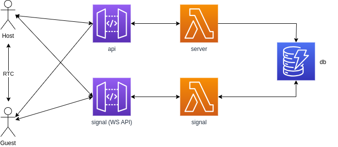

## MultiBoy

A multiplayer gameboy powered by WebRTC and [Nitric](https://nitric.io/).

> The emulator used in this project was not authored by me and is located [here](https://github.com/roblouie/gameboy-emulator). Have made minor tweaks to it to allow streaming audio.

Demo available [here](https://multiboy.nitric.rocks)

> Apologies if the demo is down, if you're interested in trying it out let me know in issues or you can also run it on your local machine or deploy it to your own AWS account.

NOTE: All WebRTC communication is Peer to peer with no relays (TURN servers), and is implemented in a hub and spoke mode. If you have any issues connecting to a peer it is likely that a TURN server will be required.

## Game Modes

This game can be hosted in three modes:

### Chaos

A chaos game accepts all player input (as if all players were holding the same gameboy).

### Shuffle

Controls are divided amongst all players on a random basis every 60 seconds.

### Hotseat

Controls are passed between players every 60 seconds.

## Development
### Requirements
  - [Nitric CLI](https://nitric.io/docs/guides/getting-started/installation)
  - Node.js
  - yarn

To run the project locally you can simply run `yarn dev`. If you have any issues raise one against this repo.

## Deployment

### Requirements
    - Pulumi

If you have AWS credentials and Pulumi configured on your machine, you should simply be able to run `yarn deploy`.

See architecture section below to see what will actually be deployed to your account.

## Architecture

The application backend consists of a simple API for managing assets and creating new games, and a websocket API to act as a signalling server for negotiating RTC connections.

Code for defining the backend is found [here](src/backend/)

Code for deploying it to AWS can be found [here](https://github.com/nitrictech/nitric/tree/develop/cloud/aws)